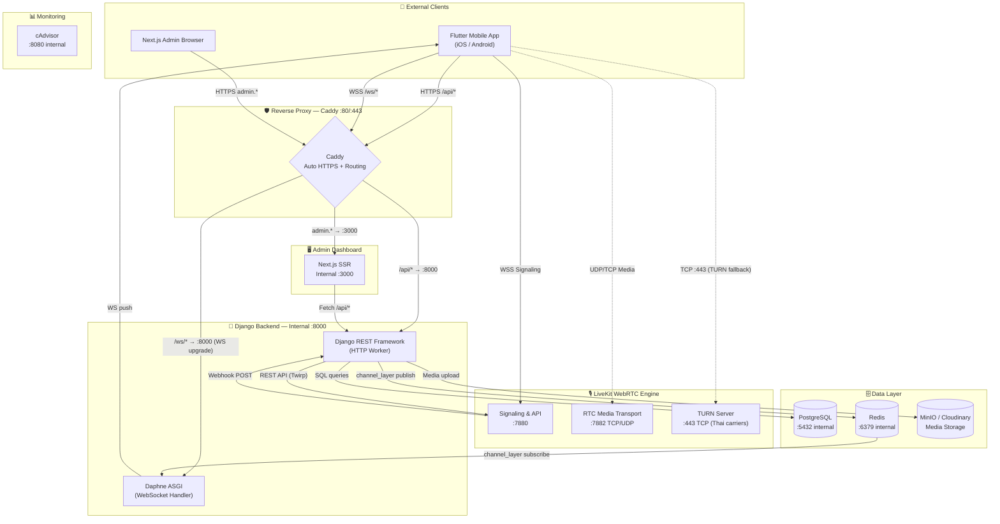

# บทที่ 2: สถาปัตยกรรมระบบ
# Chapter 2: System Architecture

---

## สารบัญบท / Chapter Contents

2.1 รูปแบบสถาปัตยกรรม (Architectural Pattern)  
2.2 Technology Stack  
2.3 Architecture Diagram  
2.4 Port Mapping และ Network Flow  
2.5 Docker Compose Stack  
2.6 การย้ายจาก Railway ไปยัง VPS (Migration Story)  
2.7 Scalability Design  

---

## 2.1 รูปแบบสถาปัตยกรรม

VivaClub ใช้รูปแบบที่เรียกว่า **"Monolithic Core with Dedicated Media Plane"** (Monolith หลัก + Media Server แยก)

**Monolithic Core:** Backend ทั้งหมด (users, community, clinical, chat) รวมอยู่ใน Django project เดียว ใช้ฐานข้อมูลร่วมกัน ทำให้:
- พัฒนาได้เร็ว (2-person team)
- Debug ง่าย
- Deploy ง่าย (Docker container เดียว)
- Transaction ข้ามตาราง (cross-app) ทำได้โดยตรง

**Dedicated Media Plane:** LiveKit รันเป็น container แยกเพราะ:
- WebRTC ต้องการ UDP transport พิเศษ (port 7882)
- Media processing (encode/decode/forward audio) ต้องการ CPU อิสระ
- Scaling LiveKit แยกจาก API ในอนาคตได้

**ทำไมไม่เป็น Full Microservices:**
ทีมพัฒนามี 2 คน Full Microservices ต้องการ service mesh, distributed tracing, cross-service auth — overhead สูงเกินไปสำหรับ MVP ขนาดนี้ Monolithic-core ให้ผลลัพธ์เดียวกันในเวลาสั้นกว่า

---

## 2.2 Technology Stack

### ตาราง Tech Stack ครบถ้วน

| Layer | Technology | Version | Rationale |
|-------|-----------|---------|-----------|
| **Mobile (Client)** | Flutter / Dart | 3.x | Cross-platform iOS+Android จาก codebase เดียว, Hot Reload เร็ว |
| **Mobile State** | flutter_bloc | 8.x | BLoC pattern แยก UI/Business logic ชัดเจน |
| **Mobile Navigation** | GoRouter | 12.x | Declarative routing, deep links, auth guards |
| **Mobile HTTP** | Dio | 5.x | Interceptors สำหรับ JWT auto-inject, error handling |
| **Mobile Secure Storage** | flutter_secure_storage | 9.x | iOS Keychain / Android Keystore — ไม่ใช้ SharedPrefs |
| **Mobile WebRTC** | livekit_client | latest | Official LiveKit SDK สำหรับ Flutter |
| **Mobile Push** | Firebase Messaging | latest | FCM cross-platform push notifications |
| **Backend Framework** | Django + DRF | 5.2.10 | Rapid development, ORM, built-in auth, REST framework |
| **Backend ASGI** | Daphne | latest | WebSocket support สำหรับ Django Channels |
| **Backend Real-time** | Django Channels | 4.x | WebSocket fan-out ผ่าน Redis channel layer |
| **Backend Auth** | SimpleJWT | latest | JWT access+refresh tokens, custom claims |
| **Backend Tasks** | Django-Q | latest | Async tasks (appointment reminders) |
| **Backend Notifications** | Firebase Admin SDK | latest | ส่ง FCM notifications จาก server |
| **Backend Storage** | Cloudinary | latest | Media file storage (production) |
| **Database** | PostgreSQL | 15 | Relational integrity, JSONB support, UUID primary keys |
| **Cache / Broker** | Redis | 7 | Channel layer, WebSocket fan-out, task queue |
| **Media Server** | LiveKit (self-hosted) | latest | SFU WebRTC สำหรับ audio rooms และ video calls |
| **Reverse Proxy** | Caddy | 2.x | Automatic HTTPS via Let's Encrypt, minimal config |
| **Admin Panel** | Next.js | 14 | SSR admin dashboard, real-time stats |
| **Containerization** | Docker + Compose | latest | Reproducible environment, easy deployment |
| **VPS Provider** | Contabo | — | Dedicated CPU/RAM, ราคาต่ำกว่า AWS, ไม่มี usage quotas |
| **Domain / DNS** | Namecheap + Cloudflare | — | DNS management, DDoS protection |

### ภาษาโปรแกรมและเครื่องมือ

| ประเภท | เครื่องมือ |
|--------|-----------|
| Backend Language | Python 3.12 |
| Mobile Language | Dart 3.x |
| Admin Language | TypeScript + React |
| Database Query | SQL via Django ORM |
| Infrastructure | YAML (Docker Compose), Caddyfile |
| Version Control | Git + GitHub |
| Testing | Custom Python scripts, Postman |

---

## 2.3 Architecture Diagram



**การไหลของข้อมูลหลัก (Data Flow Summary):**

1. **REST API Flow:** Flutter → HTTPS → Caddy → Django → PostgreSQL → response
2. **WebSocket Flow:** Flutter → WSS → Caddy → Daphne → Redis Channel Layer → Daphne → Flutter
3. **LiveKit Flow:** Flutter → LiveKit Signaling → LiveKit RTC transport (UDP) → peer participants
4. **Webhook Flow:** LiveKit → HTTP POST → Django → PostgreSQL (update participant_count)
5. **Notification Flow:** Django → Redis publish → Daphne subscribe → WebSocket push → Flutter

---

## 2.4 Port Mapping และ Network Flow

### ตาราง Port ทั้งหมด

| Service | Port | Protocol | Exposed | วัตถุประสงค์ |
|---------|------|----------|---------|------------|
| Caddy | 80 | HTTP | ✅ Public | Redirect to HTTPS |
| Caddy | 443 | HTTPS/WSS | ✅ Public | Reverse proxy entry point |
| Django/Daphne | 8000 | HTTP/WS | ❌ Internal | API + WebSocket handler |
| PostgreSQL | 5432 | TCP | ❌ Internal | Database connection |
| Redis | 6379 | TCP | ❌ Internal | Channel layer + task queue |
| LiveKit Signaling | 7880 | HTTP/WS | ✅ Via Caddy | WebRTC signaling, API control |
| LiveKit RTC | 7882 | TCP/UDP | ✅ Direct | Media streaming |
| LiveKit TURN | 443 | TCP | ✅ Shared | Thai carrier NAT traversal |
| Next.js Admin | 3000 | HTTP | ❌ Internal | Admin dashboard |
| MinIO API | 9000 | HTTP | ❌ Internal | Object storage API |
| MinIO Console | 9001 | HTTP | ❌ Internal | Storage admin UI |
| cAdvisor | 8080 | HTTP | ❌ Internal | Container monitoring |

**Security Note:** PostgreSQL และ Redis ไม่เปิด port ออกสู่ internet โดยตรง ผ่าน Docker network bridge (`vivaclub_network`) เท่านั้น ป้องกัน unauthorized database access อย่างสมบูรณ์

---

### ตัวอย่าง Data Flow: Join Room

```
1. Flutter: POST /api/community/rooms/{id}/join/
   → HTTPS → Caddy :443

2. Caddy: route /api/* → Django :8000

3. Django:
   a. ตรวจสอบ JWT token
   b. ตรวจสอบ Ghost Profile ของ user
   c. สร้าง LiveKit AccessToken (embedded metadata: ghost_id, role, is_host)
   d. บันทึก join intent ใน PostgreSQL
   e. คืน {livekit_token, livekit_url} ให้ Flutter

4. Flutter: เชื่อมต่อ LiveKit WebSocket Signaling
   → WSS wss://livekit.vivaclubs.site → LiveKit :7880

5. LiveKit: สร้าง WebRTC connection, เปิด media transport :7882

6. LiveKit: ส่ง Webhook POST ไปที่ Django
   → POST /api/community/webhook/livekit/
   → Django อัปเดต room.participant_count += 1

7. Flutter ของผู้เข้าร่วมอื่นๆ ได้รับ ParticipantConnected event จาก LiveKit SDK
   → UI อัปเดต participant list อัตโนมัติ
```

---

### ตัวอย่าง Data Flow: Real-time Notification (WebSocket)

```
1. Ghost A เปิดห้องใหม่
   → Django สร้าง Room ใน DB

2. Django: ค้นหา followers ของ Ghost A

3. Django: วนส่ง Firebase FCM notification ไปทุก follower (push)
   AND Django: publish ไปที่ Redis channel group "user_{follower_id}"
   → channel_layer.group_send(f"user_{follower_id}", {...})

4. Redis: push message เข้า channel group

5. Daphne: subscribe อยู่ที่ channel group นั้น รับ message
   → ส่ง JSON payload ลง WebSocket ที่เชื่อมต่ออยู่

6. Flutter: รับ WebSocket message
   → BlocListener แสดง in-app notification SnackBar
```

---

## 2.5 Docker Compose Stack

Production environment ใช้ **Docker Compose** ที่มี 7 containers:

```yaml
# docker-compose.prod.yml (สรุป)
services:
  web:           # Django + Daphne
    build: .
    depends_on: [db, redis]
    environment:
      - DATABASE_URL=postgresql://...
      - REDIS_URL=redis://...
      - LIVEKIT_API_URL=...
    healthcheck: ["CMD", "curl", "-f", "http://localhost:8000/api/health/"]

  db:            # PostgreSQL 15
    image: postgres:15
    volumes: [postgres_data:/var/lib/postgresql/data]
    # ไม่ expose port ออก internet

  redis:         # Redis 7
    image: redis:7-alpine
    # ไม่ expose port ออก internet

  caddy:         # Reverse Proxy
    image: caddy:2-alpine
    ports: ["80:80", "443:443"]
    volumes: [./Caddyfile:/etc/caddy/Caddyfile]

  livekit:       # WebRTC Media Server
    image: livekit/livekit-server
    ports: ["7880:7880", "7882:7882/tcp", "7882:7882/udp"]
    volumes: [./livekit.yaml:/etc/livekit.yaml]

  minio:         # Object Storage (dev/staging)
    image: minio/minio
    # internal only

  cadvisor:      # Container Monitoring
    image: gcr.io/cadvisor/cadvisor
    # internal only, Grafana/Prometheus integration planned
```

**Health Checks:** `web` container มี health check ที่ `/api/health/` — Docker รอ health check ผ่านก่อน route traffic เข้า

**Volumes:**
- `postgres_data` — persistent database storage
- `livekit_data` — room state cache
- Caddy certificates — auto-renewed by Let's Encrypt

**Network:** ทุก container อยู่ใน `vivaclub_network` bridge network ติดต่อกันผ่าน service name (เช่น `http://web:8000`) โดยไม่เปิด port ภายนอก

---

## 2.6 การย้ายจาก Railway ไปยัง Contabo VPS

### ระยะที่ 1: Railway (ช่วงเริ่มต้น)

ช่วงเริ่มต้น backend deploy บน **Railway.app** (PaaS) และ LiveKit บน **LiveKit Cloud**

**ปัญหาที่พบกับ Railway:**
| ปัญหา | รายละเอียด |
|-------|-----------|
| Database Connection Limit | PostgreSQL free tier จำกัด connections พร้อมกัน |
| LiveKit Cost | LiveKit Cloud คิดค่า minute-usage — ไม่เหมาะกับ load testing |
| WebSocket Stability | Serverless containers หมด idle timeout ทำ WebSocket drop |
| Storage Cost | Railway storage quota จำกัด |

### ระยะที่ 2: Self-hosted Contabo VPS (ปัจจุบัน)

ย้าย stack ทั้งหมดมายัง **Contabo VPS** (เยอรมนี) ที่มี:
- 4 vCPU, 8 GB RAM, 100 GB NVMe SSD
- Unlimited bandwidth
- Static IP address

**ประโยชน์ที่ได้:**
- LiveKit self-hosted → ไม่มี per-minute cost
- PostgreSQL connections ไม่จำกัด (ควบคุมเอง)
- WebSocket stable (persistent server, ไม่ใช่ serverless)
- Full control ทุกอย่าง

**ปัญหาที่พบเมื่อ migrate:**
- Apache2 ที่ติดมากับ Contabo image conflict กับ Caddy (documented ใน Chapter 9)
- Redis URL format เปลี่ยน (documented ใน Chapter 9)

---

## 2.7 Scalability Design

### Current Capacity

```
VPS Specs: 4 vCPU / 8 GB RAM / 100 GB SSD
Stress Test Results:
  - 20 concurrent users: ✅ 100% success
  - 15 concurrent rooms: ✅ 100% success
  - 10 concurrent room joins: ✅ 100% success
  - API response time: < 200ms (99th percentile)
```

### Horizontal Scaling Path (อนาคต)

**API Layer (Django):**
- Stateless design → scale horizontally ได้ทันที
- เพิ่ม Django workers ด้วย Gunicorn (เพิ่ม `--workers` flag)
- หรือ Kubernetes pod auto-scaling

**Database (PostgreSQL):**
- Read replicas สำหรับ query-heavy operations
- PgBouncer connection pooling
- Partitioning สำหรับ tables ขนาดใหญ่ (Message, Assessment)

**LiveKit:**
- LiveKit รองรับ cluster mode ตั้งแต่ต้น
- เพิ่ม LiveKit nodes ได้โดยไม่ต้องเปลี่ยน API

**Cache (Redis):**
- Redis Sentinel สำหรับ HA (High Availability)
- Redis Cluster สำหรับ horizontal sharding

**Bottleneck ที่ปัจจุบันยอมรับได้สำหรับ MVP:**
- Single PostgreSQL instance — ยอมรับได้สำหรับผู้ใช้หลักพัน
- Single Redis instance — ยอมรับได้สำหรับ ~10k concurrent WebSocket connections
- Single LiveKit node — รองรับได้ ~500 concurrent audio participants (ตาม LiveKit documentation)
