# บทที่ 5: Database Schema
# Chapter 5: Database Schema

---

## สารบัญบท / Chapter Contents

5.1 ภาพรวม (Overview)  
5.2 Entity-Relationship Diagram  
5.3 ตารางทั้งหมด (All Tables) — field-by-field reference  
5.4 การตัดสินใจด้านการออกแบบ (Key Design Decisions)  
5.5 ประวัติ Migration (Migration History)

---

## 5.1 ภาพรวม

VivaClub ใช้ **PostgreSQL 15** เป็นฐานข้อมูลหลัก ร่วมกับ **Django ORM** สำหรับการจัดการ Schema ผ่าน Migrations ทุก Model ใช้ **UUID Primary Key** เพื่อความปลอดภัย (ไม่มี enumerable integer IDs ที่สามารถ enumerate ได้) Timestamps ทุกตัวบันทึกใน UTC

**สถิติ:**
- ทั้งหมด 5 Django Apps
- ทั้งหมด 15 Django Models หลัก + หลาย Many-to-Many through tables
- PostgreSQL JSONField ใช้สำหรับข้อมูลที่มี schema ไม่แน่นอน (assessment answers, room tags, notification data)

---

## 5.2 Entity-Relationship Diagram

```mermaid
erDiagram
    USER {
        uuid id PK
        string username
        string email
        string password_hash
        string role
        string display_name
        string phone_number
        string license_id
        string specialty
        datetime verified_at
        bool is_email_verified
        string email_verification_token
        bool is_online
        string current_mood
        int streak_count
        datetime last_assessment_date
    }

    DEVICE_TOKEN {
        int id PK
        uuid user_id FK
        text token
        string device_type
        datetime created_at
        datetime last_used
    }

    GHOST_PROFILE {
        uuid id PK
        uuid user_id FK
        string display_name
        string avatar_url
        text bio
        int followers_count
        bool is_active
    }

    GHOST_SUBSCRIPTION {
        uuid id PK
        uuid follower_id FK
        uuid target_id FK
        datetime created_at
    }

    ROOM {
        uuid id PK
        string title
        uuid host_id FK
        string category
        text description
        json tags
        datetime scheduled_at
        bool is_scheduled
        float trending_score
        int peak_listeners
        int listeners_count
        int participant_count
        datetime last_active_at
        bool is_active
        datetime created_at
    }

    ROOM_BANNED_USERS {
        int id PK
        uuid room_id FK
        uuid user_id FK
    }

    ROOM_MODERATORS {
        int id PK
        uuid room_id FK
        uuid ghost_id FK
    }

    NOTIFICATION {
        uuid id PK
        uuid user_id FK
        string type
        string title
        text body
        json data
        bool is_read
        datetime created_at
    }

    FCM_TOKEN {
        int id PK
        uuid user_id FK
        string token
        datetime updated_at
    }

    USER_TRUST_SCORE {
        int id PK
        uuid user_id FK
        int score
        int total_reports_received
        int valid_reports_received
        int total_reports_made
        datetime last_updated
    }

    ROOM_REPORT {
        uuid id PK
        uuid reporter_id FK
        uuid reported_user_id FK
        uuid room_id FK
        string reason
        text description
        string status
        datetime created_at
        datetime resolved_at
        uuid resolved_by_id FK
    }

    BLOCKED_USER {
        uuid id PK
        uuid blocker_id FK
        uuid blocked_id FK
        datetime created_at
    }

    ASSESSMENT {
        uuid id PK
        uuid patient_id FK
        int total_score
        json answers
        string risk_level
        datetime created_at
    }

    TIME_SLOT {
        uuid id PK
        uuid doctor_id FK
        datetime start_time
        datetime end_time
        bool is_reserved
        bool is_confirmed
        decimal price
    }

    APPOINTMENT {
        uuid id PK
        uuid patient_id FK
        uuid doctor_id FK
        uuid slot_id FK
        string status
        datetime created_at
        datetime updated_at
    }

    SOS_CALL {
        uuid id PK
        uuid patient_id FK
        uuid assigned_doctor_id FK
        string status
        int priority_score
        datetime created_at
    }

    DOCTOR_REVIEW {
        uuid id PK
        uuid appointment_id FK
        uuid patient_id FK
        uuid doctor_id FK
        int rating
        text comment
        datetime created_at
    }

    OPD_NOTE {
        uuid id PK
        uuid appointment_id FK
        uuid doctor_id FK
        uuid patient_id FK
        text encrypted_content
        string iv
        datetime created_at
    }

    PERSONAL_NOTE {
        uuid id PK
        uuid patient_id FK
        text encrypted_content
        datetime created_at
    }

    MESSAGE {
        uuid id PK
        uuid sender_id FK
        string room_id
        text content
        bool is_redacted
        datetime created_at
    }

    READ_RECEIPT {
        int id PK
        uuid message_id FK
        uuid user_id FK
        datetime read_at
    }

    USER ||--o{ DEVICE_TOKEN : "has many"
    USER ||--|| GHOST_PROFILE : "has one"
    USER ||--|| FCM_TOKEN : "has one"
    USER ||--|| USER_TRUST_SCORE : "has one"
    GHOST_PROFILE ||--o{ GHOST_SUBSCRIPTION : "follows (follower)"
    GHOST_PROFILE ||--o{ GHOST_SUBSCRIPTION : "followed by (target)"
    GHOST_PROFILE ||--o{ ROOM : "hosts"
    ROOM ||--o{ ROOM_BANNED_USERS : "bans users"
    ROOM ||--o{ ROOM_MODERATORS : "has mods"
    USER ||--o{ NOTIFICATION : "receives"
    USER ||--o{ ROOM_REPORT : "files"
    USER ||--o{ BLOCKED_USER : "blocks (blocker)"
    USER ||--o{ BLOCKED_USER : "blocked by (blocked)"
    USER ||--o{ ASSESSMENT : "takes"
    USER ||--o{ TIME_SLOT : "creates (doctor)"
    USER ||--o{ APPOINTMENT : "books (patient)"
    USER ||--o{ APPOINTMENT : "accepts (doctor)"
    TIME_SLOT ||--|| APPOINTMENT : "reserved as"
    USER ||--o{ SOS_CALL : "requests"
    USER ||--o{ SOS_CALL : "handles (doctor)"
    APPOINTMENT ||--|| DOCTOR_REVIEW : "reviewed by"
    APPOINTMENT ||--|| OPD_NOTE : "has note"
    USER ||--o{ PERSONAL_NOTE : "writes"
    USER ||--o{ MESSAGE : "sends"
    MESSAGE ||--o{ READ_RECEIPT : "read by"
```



---

## 5.3 ตารางทั้งหมด (All Tables)

### App: Users

#### ตาราง: `users_user`

| Field | Type | Null | Default | คำอธิบาย |
|-------|------|------|---------|----------|
| `id` | UUID | No | uuid4() | Primary Key — ไม่ใช่ integer เพื่อความปลอดภัย |
| `username` | VARCHAR(150) | No | — | Username สำหรับ login |
| `email` | VARCHAR(254) | No | — | Email address, unique |
| `password` | VARCHAR(128) | No | — | Django-hashed password (PBKDF2+SHA256) |
| `role` | VARCHAR(10) | No | `'patient'` | Enum: `patient`, `doctor`, `admin` |
| `display_name` | VARCHAR(255) | Yes | NULL | ชื่อแสดงผล (ไม่เปิดเผยใน Community) |
| `phone_number` | VARCHAR(15) | Yes | NULL | เบอร์โทร, unique |
| `license_id` | VARCHAR(50) | Yes | NULL | เลขใบอนุญาตแพทย์ (เฉพาะ Doctor role) |
| `specialty` | VARCHAR(100) | Yes | NULL | ความเชี่ยวชาญของแพทย์ |
| `verified_at` | TIMESTAMPTZ | Yes | NULL | เวลาที่ admin verify แพทย์ |
| `is_email_verified` | BOOLEAN | No | `false` | ยืนยัน email แล้วหรือยัง |
| `email_verification_token` | VARCHAR(100) | Yes | NULL | Token สำหรับ verify email |
| `is_online` | BOOLEAN | No | `false` | Doctor online status |
| `current_mood` | VARCHAR(20) | No | `'UNKNOWN'` | Mood ล่าสุดจาก PHQ-9: UNKNOWN/LOW/MODERATE/SEVERE |
| `streak_count` | INTEGER | No | `0` | จำนวนวันต่อเนื่องที่ทำ assessment |
| `last_assessment_date` | TIMESTAMPTZ | Yes | NULL | วันเวลาที่ทำ assessment ล่าสุด |
| `is_active` | BOOLEAN | No | `true` | Django built-in: บัญชีถูก ban หรือยัง |
| `is_staff` | BOOLEAN | No | `false` | Django admin access |
| `date_joined` | TIMESTAMPTZ | No | now() | วันที่สมัคร |
| `last_login` | TIMESTAMPTZ | Yes | NULL | login ล่าสุด |

**Indexes:** `username` (unique), `email` (unique), `phone_number` (unique)

---

#### ตาราง: `users_devicetoken`

| Field | Type | Null | Default | คำอธิบาย |
|-------|------|------|---------|----------|
| `id` | INTEGER | No | auto | Primary Key |
| `user_id` | UUID FK | No | — | FK → users_user.id |
| `token` | TEXT | No | — | FCM device token, unique |
| `device_type` | VARCHAR(20) | No | — | Enum: `ios`, `android`, `web` |
| `created_at` | TIMESTAMPTZ | No | now() | วันที่ลงทะเบียน |
| `last_used` | TIMESTAMPTZ | No | auto_update | อัปเดตอัตโนมัติเมื่อ token ถูกใช้ |

**Indexes:** `token` (unique), `user_id`

---

### App: Community

#### ตาราง: `community_ghostprofile`

| Field | Type | Null | Default | คำอธิบาย |
|-------|------|------|---------|----------|
| `id` | UUID | No | uuid4() | Primary Key |
| `user_id` | UUID FK | No | — | OneToOne → users_user.id |
| `display_name` | VARCHAR(255) | No | — | ชื่อ Ghost เช่น "Happy Panda #42" |
| `avatar_url` | VARCHAR(500) | Yes | NULL | URL รูปโปรไฟล์ (ไม่บังคับ) |
| `bio` | TEXT | No | `''` | Bio/About me |
| `followers_count` | INTEGER | No | `0` | จำนวนผู้ติดตาม (denormalized counter) |
| `is_active` | BOOLEAN | No | `true` | Ghost profile ยังใช้งานอยู่หรือไม่ |

**Note:** สร้างอัตโนมัติเมื่อ User ลงทะเบียน ผ่าน post_save signal

---

#### ตาราง: `community_ghostsubscription`

| Field | Type | Null | Default | คำอธิบาย |
|-------|------|------|---------|----------|
| `id` | UUID | No | uuid4() | Primary Key |
| `follower_id` | UUID FK | No | — | FK → community_ghostprofile.id (ผู้ติดตาม) |
| `target_id` | UUID FK | No | — | FK → community_ghostprofile.id (ผู้ถูกติดตาม) |
| `created_at` | TIMESTAMPTZ | No | now() | วันที่ติดตาม |

**Constraints:** `UNIQUE(follower_id, target_id)` — ป้องกัน follow ซ้ำ

---

#### ตาราง: `community_room`

| Field | Type | Null | Default | คำอธิบาย |
|-------|------|------|---------|----------|
| `id` | UUID | No | uuid4() | Primary Key |
| `title` | VARCHAR(255) | No | — | ชื่อห้อง (ผ่าน profanity filter) |
| `host_id` | UUID FK | No | — | FK → community_ghostprofile.id |
| `category` | VARCHAR(50) | No | `'general'` | Enum: general, depression, anxiety, relationships, burnout, sleep |
| `description` | TEXT | No | `''` | คำอธิบายห้อง |
| `tags` | JSONB | No | `[]` | Array of tag strings |
| `scheduled_at` | TIMESTAMPTZ | Yes | NULL | เวลานัดสำหรับห้องที่ scheduled |
| `is_scheduled` | BOOLEAN | No | `false` | เป็น scheduled room หรือไม่ |
| `trending_score` | FLOAT | No | `0.0` | Trending score คำนวณจาก activity |
| `peak_listeners` | INTEGER | No | `0` | จำนวนสูงสุดที่เคยมีใน room |
| `listeners_count` | INTEGER | No | `0` | Listeners ปัจจุบัน (updated by webhook) |
| `participant_count` | INTEGER | No | `0` | Participants ทั้งหมด (updated by webhook) |
| `last_active_at` | TIMESTAMPTZ | No | auto_update | เวลาที่มี activity ล่าสุด |
| `is_active` | BOOLEAN | No | `true` | ห้องเปิดอยู่หรือไม่ |
| `created_at` | TIMESTAMPTZ | No | now() | วันที่สร้าง |

**M2M Relations:**
- `banned_users` → users_user (ผ่าน community_room_banned_users)
- `moderators` → community_ghostprofile (ผ่าน community_room_moderators)

---

#### ตาราง: `community_notification`

| Field | Type | Null | Default | คำอธิบาย |
|-------|------|------|---------|----------|
| `id` | UUID | No | uuid4() | Primary Key |
| `user_id` | UUID FK | No | — | FK → users_user.id (ผู้รับ notification) |
| `type` | VARCHAR(50) | No | — | Enum: ghost_room_opened, hand_raise_accepted, room_invite |
| `title` | VARCHAR(255) | No | — | หัวข้อ notification |
| `body` | TEXT | No | — | เนื้อหา notification |
| `data` | JSONB | No | `{}` | Extra data เช่น {room_id, ghost_id} |
| `is_read` | BOOLEAN | No | `false` | อ่านแล้วหรือยัง |
| `created_at` | TIMESTAMPTZ | No | now() | เวลาที่สร้าง |

**Ordering:** `-created_at` (ใหม่สุดก่อน)

---

#### ตาราง: `community_fcmtoken`

| Field | Type | Null | Default | คำอธิบาย |
|-------|------|------|---------|----------|
| `id` | INTEGER | No | auto | Primary Key |
| `user_id` | UUID FK | No | — | OneToOne → users_user.id |
| `token` | VARCHAR(255) | No | — | Firebase Cloud Messaging token |
| `updated_at` | TIMESTAMPTZ | No | auto_update | อัปเดตอัตโนมัติ |

---

#### ตาราง: `community_usertrustscore`

| Field | Type | Null | Default | คำอธิบาย |
|-------|------|------|---------|----------|
| `id` | INTEGER | No | auto | Primary Key |
| `user_id` | UUID FK | No | — | OneToOne → users_user.id |
| `score` | INTEGER | No | `100` | คะแนน 0–200 (เริ่มที่ 100) |
| `total_reports_received` | INTEGER | No | `0` | รายงานที่ได้รับทั้งหมด |
| `valid_reports_received` | INTEGER | No | `0` | รายงานที่ valid (admin ยืนยัน) |
| `total_reports_made` | INTEGER | No | `0` | รายงานที่ทำไว้ทั้งหมด |
| `last_updated` | TIMESTAMPTZ | No | auto_update | อัปเดตอัตโนมัติ |

**Business Rule:** score ลดลงเมื่อได้รับ valid report; เพิ่มขึ้นเมื่อรายงานของตัวเองถูกยืนยัน

---

#### ตาราง: `community_roomreport`

| Field | Type | Null | Default | คำอธิบาย |
|-------|------|------|---------|----------|
| `id` | UUID | No | uuid4() | Primary Key |
| `reporter_id` | UUID FK | No | — | FK → users_user.id (ผู้รายงาน) |
| `reported_user_id` | UUID FK | No | — | FK → users_user.id (ผู้ถูกรายงาน) |
| `room_id` | UUID FK | Yes | NULL | FK → community_room.id (SET_NULL เมื่อห้องลบ) |
| `reason` | VARCHAR(50) | No | — | Enum: harassment, spam, inappropriate, self_harm, other |
| `description` | TEXT | No | `''` | รายละเอียดเพิ่มเติม |
| `status` | VARCHAR(20) | No | `'pending'` | Enum: pending, valid, invalid |
| `created_at` | TIMESTAMPTZ | No | now() | วันที่รายงาน |
| `resolved_at` | TIMESTAMPTZ | Yes | NULL | วันที่ resolve |
| `resolved_by_id` | UUID FK | Yes | NULL | FK → users_user.id (admin ที่ resolve) |

---

#### ตาราง: `community_blockeduser`

| Field | Type | Null | Default | คำอธิบาย |
|-------|------|------|---------|----------|
| `id` | UUID | No | uuid4() | Primary Key |
| `blocker_id` | UUID FK | No | — | FK → users_user.id (ผู้ block) |
| `blocked_id` | UUID FK | No | — | FK → users_user.id (ผู้ถูก block) |
| `created_at` | TIMESTAMPTZ | No | now() | วันที่ block |

**Constraints:** `UNIQUE(blocker_id, blocked_id)` — block ซ้ำไม่ได้

---

### App: Clinical

#### ตาราง: `clinical_assessment`

| Field | Type | Null | Default | คำอธิบาย |
|-------|------|------|---------|----------|
| `id` | UUID | No | uuid4() | Primary Key |
| `patient_id` | UUID FK | No | — | FK → users_user.id |
| `total_score` | INTEGER | No | — | คะแนน PHQ-9 รวม (0–27) |
| `answers` | JSONB | No | `{}` | คำตอบแต่ละข้อ เช่น `{"Q1": 2, "Q2": 1, ...}` |
| `risk_level` | VARCHAR(20) | No | — | Enum: LOW, MODERATE, SEVERE |
| `created_at` | TIMESTAMPTZ | No | now() | วันที่ทำ assessment |

**Business Rules:**
- total_score 0–9 → LOW
- total_score 10–18 → MODERATE  
- total_score 19–27 → SEVERE (ปลดล็อค SOS)
- ทำซ้ำได้ทุก 24 ชั่วโมง (cooldown check ใน view)

---

#### ตาราง: `clinical_timeslot`

| Field | Type | Null | Default | คำอธิบาย |
|-------|------|------|---------|----------|
| `id` | UUID | No | uuid4() | Primary Key |
| `doctor_id` | UUID FK | No | — | FK → users_user.id (doctor เท่านั้น) |
| `start_time` | TIMESTAMPTZ | No | — | เวลาเริ่มต้น |
| `end_time` | TIMESTAMPTZ | No | — | เวลาสิ้นสุด |
| `is_reserved` | BOOLEAN | No | `false` | มีคนจองแล้วหรือยัง |
| `is_confirmed` | BOOLEAN | No | `false` | แพทย์ยืนยันแล้วหรือยัง |
| `price` | DECIMAL(10,2) | No | `0.00` | ราคาต่อ slot |

**Ordering:** `start_time` (ascending)

---

#### ตาราง: `clinical_appointment`

| Field | Type | Null | Default | คำอธิบาย |
|-------|------|------|---------|----------|
| `id` | UUID | No | uuid4() | Primary Key |
| `patient_id` | UUID FK | No | — | FK → users_user.id |
| `doctor_id` | UUID FK | No | — | FK → users_user.id |
| `slot_id` | UUID FK | No | — | OneToOne → clinical_timeslot.id (PROTECT) |
| `status` | VARCHAR(20) | No | `'PENDING'` | Enum: PENDING, CONFIRMED, COMPLETED, CANCELLED |
| `created_at` | TIMESTAMPTZ | No | now() | วันที่นัดหมาย |
| `updated_at` | TIMESTAMPTZ | No | auto_update | อัปเดตอัตโนมัติ |

**State Machine:** `PENDING → CONFIRMED → COMPLETED` หรือ `PENDING/CONFIRMED → CANCELLED`

---

#### ตาราง: `clinical_soscall`

| Field | Type | Null | Default | คำอธิบาย |
|-------|------|------|---------|----------|
| `id` | UUID | No | uuid4() | Primary Key |
| `patient_id` | UUID FK | No | — | FK → users_user.id |
| `assigned_doctor_id` | UUID FK | Yes | NULL | FK → users_user.id (SET_NULL ถ้าแพทย์ออก) |
| `status` | VARCHAR(20) | No | `'WAITING'` | Enum: WAITING, ONGOING, RESOLVED, CANCELLED |
| `priority_score` | INTEGER | No | `0` | PHQ-9 score ที่ copy มา (ยิ่งสูง ยิ่งเร่งด่วน) |
| `created_at` | TIMESTAMPTZ | No | now() | วันที่ร้องขอ SOS |

**Ordering:** `-priority_score, created_at` — priority สูงก่อน, เวลาเดียวกันเอาที่รอนานกว่า

---

#### ตาราง: `clinical_doctorreview`

| Field | Type | Null | Default | คำอธิบาย |
|-------|------|------|---------|----------|
| `id` | UUID | No | uuid4() | Primary Key |
| `appointment_id` | UUID FK | No | — | OneToOne → clinical_appointment.id |
| `patient_id` | UUID FK | No | — | FK → users_user.id |
| `doctor_id` | UUID FK | No | — | FK → users_user.id |
| `rating` | INTEGER | No | — | 1–5 stars (validated with MinValue/MaxValue) |
| `comment` | TEXT | No | `''` | คอมเมนต์เพิ่มเติม |
| `created_at` | TIMESTAMPTZ | No | now() | วันที่รีวิว |

---

#### ตาราง: `clinical_opdnote`

| Field | Type | Null | Default | คำอธิบาย |
|-------|------|------|---------|----------|
| `id` | UUID | No | uuid4() | Primary Key |
| `appointment_id` | UUID FK | Yes | NULL | OneToOne → clinical_appointment.id (ลบ appointment ไม่ลบ note) |
| `doctor_id` | UUID FK | No | — | FK → users_user.id (แพทย์ผู้บันทึก) |
| `patient_id` | UUID FK | Yes | NULL | FK → users_user.id |
| `encrypted_content` | TEXT | No | — | เนื้อหาที่ encrypt แล้ว (client-side encryption) |
| `iv` | VARCHAR(255) | No | — | Initialization Vector สำหรับ decrypt |
| `created_at` | TIMESTAMPTZ | No | now() | วันที่บันทึก |

**Security Note:** Server เก็บ ciphertext เท่านั้น ไม่สามารถอ่านเนื้อหาได้

---

#### ตาราง: `clinical_personalnote`

| Field | Type | Null | Default | คำอธิบาย |
|-------|------|------|---------|----------|
| `id` | UUID | No | uuid4() | Primary Key |
| `patient_id` | UUID FK | No | — | FK → users_user.id |
| `encrypted_content` | TEXT | No | — | เนื้อหาที่ encrypt แล้ว |
| `created_at` | TIMESTAMPTZ | No | now() | วันที่บันทึก |

---

### App: Chat

#### ตาราง: `chat_message`

| Field | Type | Null | Default | คำอธิบาย |
|-------|------|------|---------|----------|
| `id` | UUID | No | uuid4() | Primary Key |
| `sender_id` | UUID FK | No | — | FK → users_user.id |
| `room_id` | VARCHAR(255) | No | — | Generic room identifier (indexed) |
| `content` | TEXT | No | — | เนื้อหาข้อความ |
| `is_redacted` | BOOLEAN | No | `false` | ถูก redact โดย DLP หรือไม่ |
| `created_at` | TIMESTAMPTZ | No | now() | เวลาส่ง |

**room_id Patterns:**
- `dm_<sorted_uuid1>_<sorted_uuid2>` — 1-on-1 DM (UUID เรียงตามตัวอักษรเสมอ)
- `room_<uuid>` — Clubhouse room chat

**Ordering:** `created_at` (ascending — เก่าสุดก่อน)  
**Index:** `room_id` (db_index=True)

---

#### ตาราง: `chat_readreceipt`

| Field | Type | Null | Default | คำอธิบาย |
|-------|------|------|---------|----------|
| `id` | INTEGER | No | auto | Primary Key |
| `message_id` | UUID FK | No | — | FK → chat_message.id |
| `user_id` | UUID FK | No | — | FK → users_user.id |
| `read_at` | TIMESTAMPTZ | No | now() | เวลาที่อ่าน |

**Constraints:** `UNIQUE(message_id, user_id)` — อ่านซ้ำไม่ได้

---

## 5.4 การตัดสินใจด้านการออกแบบ

### 1. UUID Primary Keys ทุกตาราง

**เหตุผล:** Integer IDs สามารถ enumerate ได้ (ผู้ไม่หวังดีสามารถลอง `GET /api/appointments/1`, `2`, `3`... เพื่อดูข้อมูลคนอื่น) UUID แก้ปัญหานี้ได้สมบูรณ์ สำหรับแพลตฟอร์มข้อมูลสุขภาพ นี่เป็น requirement ที่สำคัญมาก

### 2. JSONField สำหรับข้อมูลที่มี Schema ไม่แน่นอน

- **`Assessment.answers`** — จำนวนคำถาม PHQ-9 อาจเปลี่ยนในอนาคต, format เป็น `{"Q1": 0, "Q2": 2, ...}`
- **`Room.tags`** — user-defined tags ไม่รู้ล่วงหน้าว่าจะมีกี่ tag
- **`Notification.data`** — payload ต่างกันตาม notification type

### 3. E2EE Pattern สำหรับ Clinical Notes

```
OpdNote: encrypted_content + iv
PersonalNote: encrypted_content
```

Server เก็บเฉพาะ ciphertext กับ IV ไม่มี encryption key ที่ server เด็ดขาด Key อยู่ที่ client เท่านั้น ซึ่งสอดคล้องกับ PDPA ด้านการจำกัดการเข้าถึงข้อมูลสุขภาพ

### 4. Generic room_id ใน Chat.Message

แทนที่จะใช้ FK ไปยัง Room model, chat ใช้ string pattern:
```
dm_<uuid1>_<uuid2>  →  1-on-1 DM
room_<uuid>         →  Clubhouse room chat
appointment_<uuid>  →  ในอนาคตสำหรับ video consultation chat
```
ทำให้ chat module เป็น "generic" และไม่ผูกกับ model ใดโดยตรง

### 5. UniqueConstraints สำหรับ Relationship Tables

```python
# GhostSubscription — ป้องกัน follow ซ้ำ
UniqueConstraint(fields=['follower', 'target'], name='unique_ghost_follow')

# BlockedUser — ป้องกัน block ซ้ำ
UniqueConstraint(fields=['blocker', 'blocked'], name='unique_block')
```

Enforce ที่ DB level ไม่ใช่แค่ application level — ป้องกัน race condition ด้วย

### 6. OneToOne vs ForeignKey

| กรณี | Design | เหตุผล |
|------|--------|--------|
| User ↔ GhostProfile | OneToOne | User มี Ghost Profile ได้แค่ 1 |
| User ↔ FCMToken | OneToOne | 1 FCM token ต่อ user (overwrite เมื่อเปลี่ยนอุปกรณ์) |
| TimeSlot ↔ Appointment | OneToOne | Slot จองได้ครั้งเดียว |
| Appointment ↔ OpdNote | OneToOne | 1 appointment = 1 note |
| Appointment ↔ DoctorReview | OneToOne | รีวิวได้ครั้งเดียวต่อ appointment |

### 7. Soft Delete vs Hard Delete

Room ที่หมดเวลา (ไม่มีคนใน 65 วินาที) ถูก mark `is_active=False` แทนการ delete ทำให้:
- ประวัติห้องยังอยู่ใน DB
- Admin ยังสามารถตรวจสอบย้อนหลังได้
- รายงาน (RoomReport) ที่อ้างถึงห้องยังสมบูรณ์

---

## 5.5 ประวัติ Migration

ตารางด้านล่างแสดง migration หลักๆ แต่ละ app:

### users app
| Migration | สิ่งที่เพิ่ม |
|-----------|------------|
| 0001_initial | User model พื้นฐาน (UUID PK, role, display_name) |
| 0002 | เพิ่ม phone_number, license_id, specialty |
| 0003 | เพิ่ม email verification fields |
| 0004 | เพิ่ม is_online, current_mood, streak_count |
| 0005 | เพิ่ม DeviceToken model |

### community app
| Migration | สิ่งที่เพิ่ม |
|-----------|------------|
| 0001_initial | GhostProfile, Room (basic) |
| 0002 | เพิ่ม GhostSubscription, Notification |
| 0003 | เพิ่ม FCMToken, UserTrustScore |
| 0004 | เพิ่ม RoomReport, BlockedUser |
| 0005 | เพิ่ม Room.tags, Room.description, Room.trending_score |
| 0006 | เพิ่ม Room.banned_users (M2M), Room.moderators (M2M) |

### clinical app
| Migration | สิ่งที่เพิ่ม |
|-----------|------------|
| 0001_initial | Assessment model |
| 0002 | เพิ่ม TimeSlot, Appointment |
| 0003 | เพิ่ม SOSCall |
| 0004 | เพิ่ม DoctorReview |
| 0005 | เพิ่ม OpdNote, PersonalNote |

### chat app
| Migration | สิ่งที่เพิ่ม |
|-----------|------------|
| 0001_initial | Message model |
| 0002 | เพิ่ม ReadReceipt |
