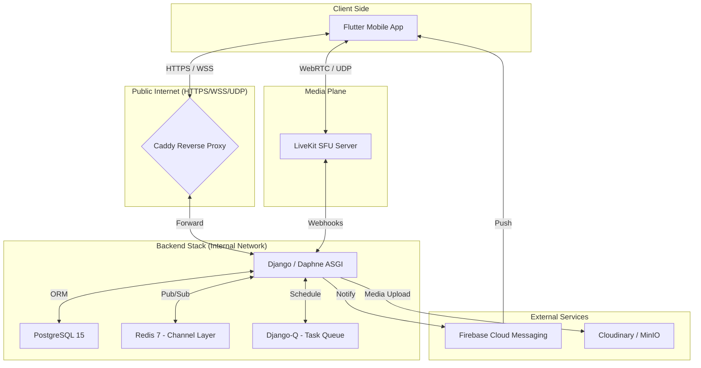

# บทที่ 2: สถาปัตยกรรมระบบ
# Chapter 2: System Architecture

---

## 2.1 รูปแบบสถาปัตยกรรม (Architectural Pattern)

VivaClub ใช้รูปแบบสถาปัตยกรรมที่เรียกว่า **"Monolithic Core with Dedicated Media Plane"** ซึ่งเป็นการรวมศูนย์ตรรกะทางธุรกิจไว้ในที่เดียว แต่แยกส่วนการประมวลผลสื่อ (Media Processing) ออกมาเพื่อประสิทธิภาพสูงสุด

- **Monolithic Core:** บริการหลักทั้งหมด (Users, Community, Clinical, Chat) รวมอยู่ใน Django Project เดียวกันเพื่อให้ง่ายต่อการพัฒนาและจัดการข้อมูลข้ามโมดูล
- **Dedicated Media Plane:** แยกส่วน LiveKit Server ออกมาต่างหาก เนื่องจาก WebRTC ต้องการทรัพยากร CPU และการจัดการ Network Port (UDP) ที่เฉพาะเจาะจง

---

## 2.2 โครงสร้างทางเทคโนโลยี (Technology Stack)

ระบบเลือกใช้เทคโนโลยีที่ทันสมัยและเป็นที่ยอมรับในระดับสากล เพื่อรองรับการทำงานแบบข้ามแพลตฟอร์มและมีความปลอดภัยสูง (รายละเอียดดังตารางในหัวข้อ 2.2 เดิม)

---

## 2.3 แผนผังโครงสร้างระบบ (Architecture Diagram)

แผนผังด้านล่างแสดงการเชื่อมต่อระหว่างส่วนประกอบต่างๆ ตั้งแต่ฝั่งไคลเอนต์ (Mobile App) ผ่านระบบรักษาความปลอดภัยไปยังส่วนประมวลผลหลักและฐานข้อมูล:

---

## 2.4 การไหลของข้อมูลและเครือข่าย (Network Flow)

ระบบมีการจัดการเครือข่ายอย่างรัดกุม โดยใช้ **Docker Network Bridge** เพื่อให้แต่ละส่วนประกอบติดต่อกันภายในได้โดยไม่ต้องเปิดพอร์ตสู่สาธารณะ ยกเว้นพอร์ตที่จำเป็นสำหรับการเข้าถึงของผู้ใช้งาน:
- **Port 80/443 (HTTP/HTTPS):** สำหรับ API และการรับส่งข้อมูลทั่วไป
- **Port 7880/7882 (LiveKit):** สำหรับการรับส่งสัญญาณสื่อเรียลไทม์ (Audio/Video Streaming)

### ตัวอย่างการไหลของข้อมูล: ระบบแจ้งเตือนเรียลไทม์
1. เมื่อเกิดเหตุการณ์ใน Django View ระบบจะส่งข้อมูลไปยัง **Redis Channel Layer**
2. **Daphne (ASGI)** ที่ทำหน้าที่ถือการเชื่อมต่อ WebSocket จะรับข้อมูลจาก Redis
3. ข้อมูลจะถูก Push ไปยังแอปพลิเคชัน Flutter ผ่านทาง WebSocket Connection ที่เปิดค้างไว้ทันที

---

## 2.5 การปรับขยายระบบในอนาคต (Scalability Design)

สถาปัตยกรรมถูกออกแบบมาให้รองรับการขยายตัวในอนาคต (Scalability):
- **Stateless API:** ทำให้สามารถเพิ่มจำนวน Docker Container ของฝั่ง Backend ได้ทันทีเพื่อรองรับผู้ใช้ที่เพิ่มขึ้น
- **Database Read Replicas:** รองรับการแยกเซิร์ฟเวอร์อ่านข้อมูลเพื่อลดภาระของฐานข้อมูลหลัก
- **LiveKit Clustering:** สามารถเพิ่มจำนวน Media Node ได้โดยไม่ต้องเปลี่ยนโครงสร้างแอปพลิเคชันหลัก
