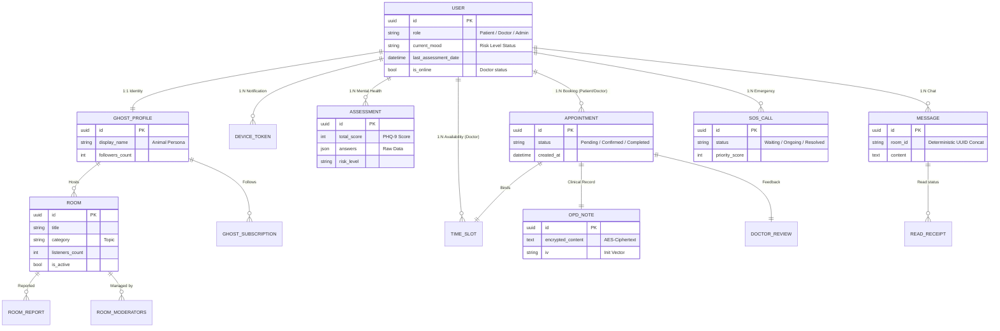

# บทที่ 5: แผนผังฐานข้อมูล (Database Schema)
# Chapter 5: Database Schema

---

## 5.1 ผังความสัมพันธ์เอนทิตี (Entity-Relationship Diagram)

ฐานข้อมูลของ VivaClub ถูกออกแบบบนระบบ **PostgreSQL** โดยเน้นความสัมพันธ์ที่รัดกุมและการรักษาความปลอดภัยของข้อมูลสุขภาพเป็นสำคัญ แผนผังด้านล่างแสดงโครงสร้างเอนทิตีและความสัมพันธ์ทั้งหมดภายในระบบ:

---

## 5.2 ปรัชญาการออกแบบฐานข้อมูล (Key Design Decisions)

เพื่อให้ระบบมีความปลอดภัยและยืดหยุ่นตามมาตรฐานสากล ทีมพัฒนาได้ตัดสินใจเชิงสถาปัตยกรรมดังนี้:

1.  **UUID Primary Keys:** ทุกตารางใช้ UUID แทน Integer IDs เพื่อป้องกันการสุ่มเดาหมายเลขรายการ (ID Enumeration) ซึ่งเป็นมาตรฐานสำคัญสำหรับข้อมูลสุขภาพที่มีความอ่อนไหวสูง
2.  **End-to-End Encrypted Storage (E2EE):** ในตาราง `OPD_NOTE` ระบบจะเก็บเพียงข้อมูลที่ถูกเข้ารหัสแล้ว (Ciphertext) และ IV เท่านั้น โดยไม่มีการเก็บกุญแจถอดรหัสไว้ที่ฝั่งเซิร์ฟเวอร์ เพื่อให้เป็นไปตามข้อกำหนด PDPA
3.  **JSONField Flexibility:** ใช้โครงสร้างข้อมูลแบบ JSONB ในฟิลด์คำตอบแบบทดสอบ (Assessment Answers) และข้อมูลเสริมของห้องสนทนา เพื่อรองรับการปรับเปลี่ยนรูปแบบข้อมูลในอนาคตโดยไม่ต้องเปลี่ยนโครงสร้างฐานข้อมูล (Schema Migration)
4.  **Soft Delete Pattern:** สำหรับข้อมูลสำคัญเช่น ห้องสนทนา (Rooms) ระบบจะใช้สถานะ `is_active` แทนการลบข้อมูลจริง เพื่อให้สามารถตรวจสอบย้อนหลังได้ในกรณีที่มีการรายงานความประพฤติ (Room Reports) เกิดขึ้น
5.  **Deterministic Room IDs:** ในระบบแชท ระบบจะใช้วิธีการจัดเรียง UUID ของผู้สนทนาและนำมาเชื่อมกันเพื่อสร้าง `room_id` ที่แน่นอน ทำให้ไม่ว่าใครจะเป็นผู้เริ่มสนทนา ระบบจะระบุไปยังห้องแชทเดียวกันเสมอโดยไม่ต้องสร้างตารางความสัมพันธ์เพิ่มเติม
