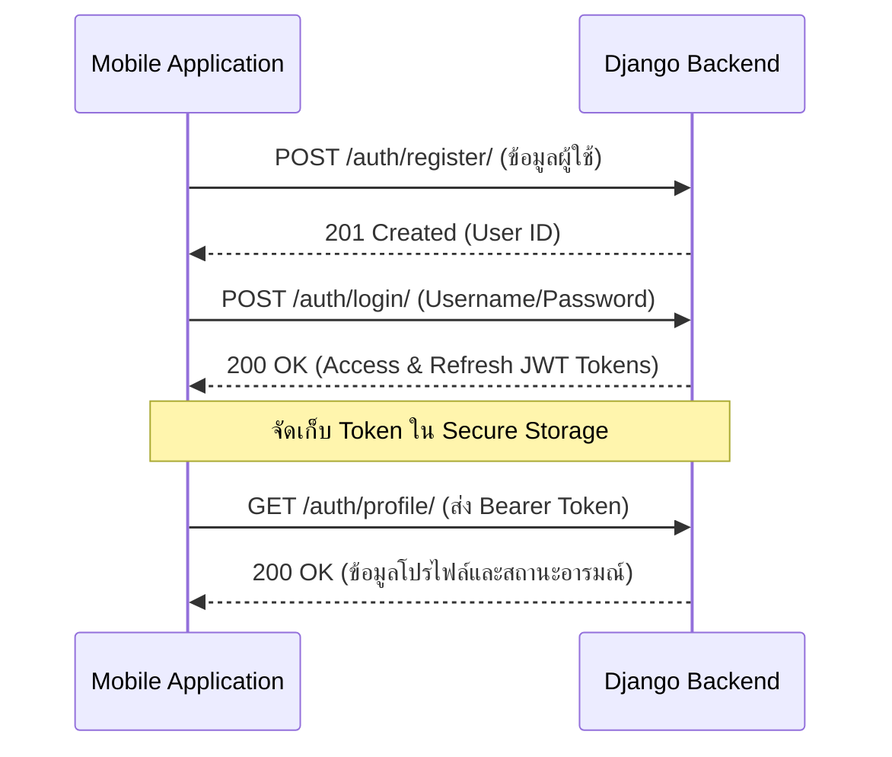
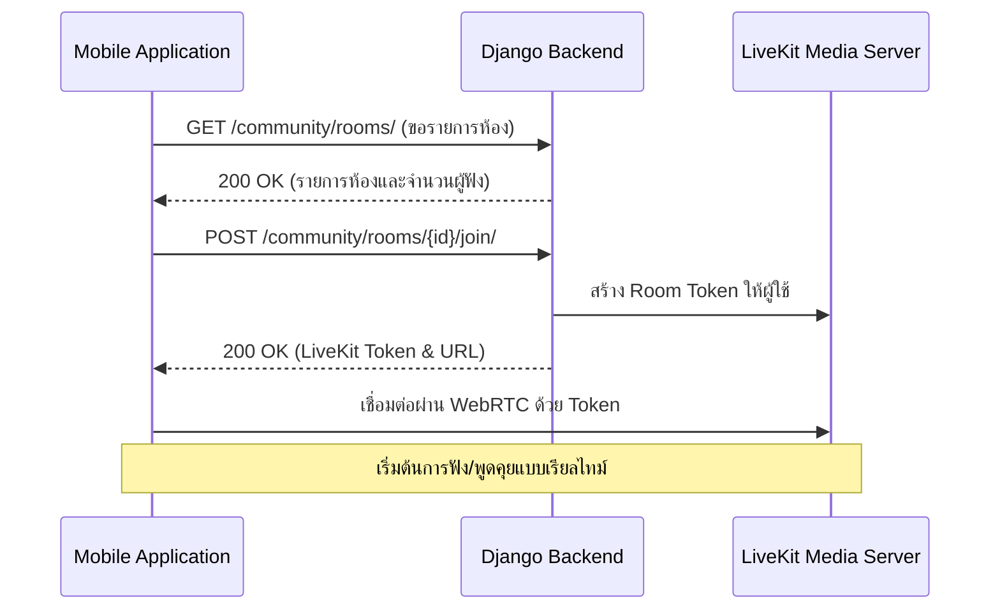
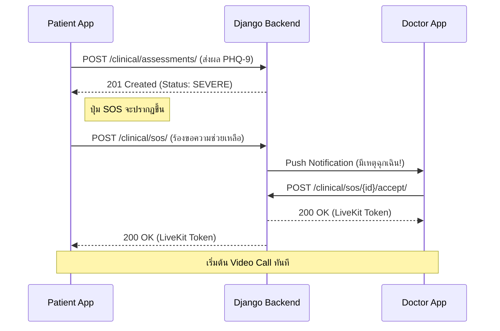

# บทที่ 6: รายละเอียดการเชื่อมต่อระบบ (API Reference)
# Chapter 6: API Reference

---

## 6.1 ข้อมูลพื้นฐานและการรักษาความปลอดภัย

ในการสื่อสารระหว่างแอปพลิเคชันและเซิร์ฟเวอร์ ระบบใช้มาตรฐาน **RESTful API** ผ่านโปรโตคอล HTTPS เพื่อความปลอดภัยสูงสุด

- **Base URL:** `https://vivaclubs.site/api/`
- **Authentication:** ใช้ระบบ **Bearer JWT Token** โดยผู้ใช้ต้องส่ง Token ใน HTTP Header (`Authorization: Bearer <access_token>`) ทุกครั้งที่เรียกใช้งาน API ยกเว้นหน้าการเข้าสู่ระบบ
- **Response Format:** ข้อมูลทั้งหมดจะถูกส่งกลับในรูปแบบ **JSON**

---

## 6.2 แผนภาพขั้นตอนการทำงานหลัก (Core API Flows)

เพื่อให้เห็นภาพการทำงานร่วมกันระหว่าง Mobile Application และ Backend ระบบได้ออกแบบขั้นตอนการทำงานหลักดังนี้:

### การพิสูจน์ตัวตน (Authentication Flow)

### ระบบห้องสนทนาเสียง (Community Room Flow)

### ระบบช่วยเหลือฉุกเฉิน (SOS Emergency Flow)

---

## 6.3 สรุปรายการช่องทางการเชื่อมต่อ (API Endpoints Summary)

### ระบบบัญชีและตัวตน (Authentication & Identity)
- **การลงทะเบียนและเข้าสู่ระบบ:** รองรับการสมัครสมาชิกใหม่ (`/auth/register/`), การเข้าสู่ระบบเพื่อรับ Token (`/auth/login/`) และการขอ Token ใหม่เมื่อหมดอายุ (`/auth/token/refresh/`)
- **การจัดการโปรไฟล์:** การเรียกดูข้อมูลส่วนตัว (`/auth/profile/`) และการอัปเดตข้อมูลผู้ใช้หรือเบอร์โทรศัพท์
- **ระบบกู้คืน:** การยืนยันอีเมลและการขอเปลี่ยนรหัสผ่านผ่านระบบ Token

### ระบบชุมชนและพื้นที่เสมือน (Community & Audio)
- **Ghost Profile:** จัดการตัวตนเสมือน (`/community/ghosts/me/`) และระบบการติดตามผู้ใช้อื่น (Follow/Unfollow)
- **การจัดการห้อง:** ค้นหาห้องสนทนาตามหมวดหมู่ (`/community/rooms/`), การสร้างห้องใหม่ และการขอสิทธิ์เข้าร่วมเพื่อรับสื่อเรียลไทม์
- **ความปลอดภัยในชุมชน:** ระบบการแจ้งเตือน (Notifications), การรายงานผู้ใช้ที่ไม่เหมาะสม (Reports) และการบล็อกผู้ใช้ (Blocks)

### ระบบให้คำปรึกษาและสุขภาพ (Clinical & Health)
- **การประเมินผล:** การส่งคะแนนประเมินสุขภาพจิต PHQ-9 (`/clinical/assessments/`) ซึ่งจะนำไปสู่การกำหนดระดับความเสี่ยง
- **การนัดหมายแพทย์:** ค้นหารายชื่อแพทย์ที่ออนไลน์อยู่ (`/clinical/doctors/`), ตรวจสอบตารางเวลาว่าง และการจองนัดหมายคิวรักษา (`/clinical/appointments/`)
- **ระบบฉุกเฉิน (SOS):** การตรวจสอบคิว SOS แบบเรียลไทม์สำหรับคนไข้ และการจัดการคิวสำหรับคุณหมอ

### ระบบสื่อสารเรียลไทม์ (Chat & WebSockets)
- **ข้อความส่วนตัว:** การเรียกดูประวัติการแชทย้อนหลัง (`/chat/messages/`) และการระบุสถานะการอ่านข้อความ
- **การเชื่อมต่อแบบถาวร:** ใช้ WebSocket Protocol (`/ws/notifications/`) สำหรับการรับการแจ้งเตือนแบบทันทีโดยไม่ต้องรอการเรียกจากไคลเอนต์
