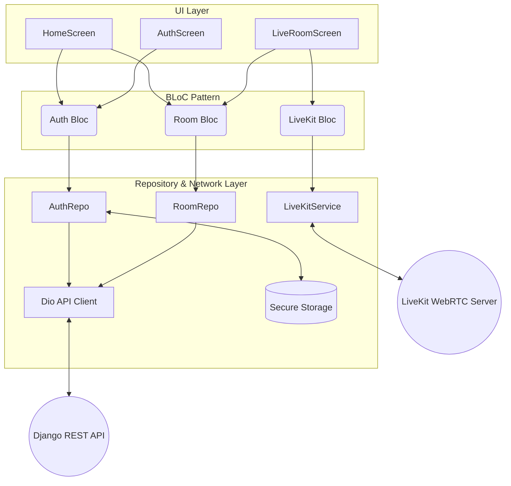
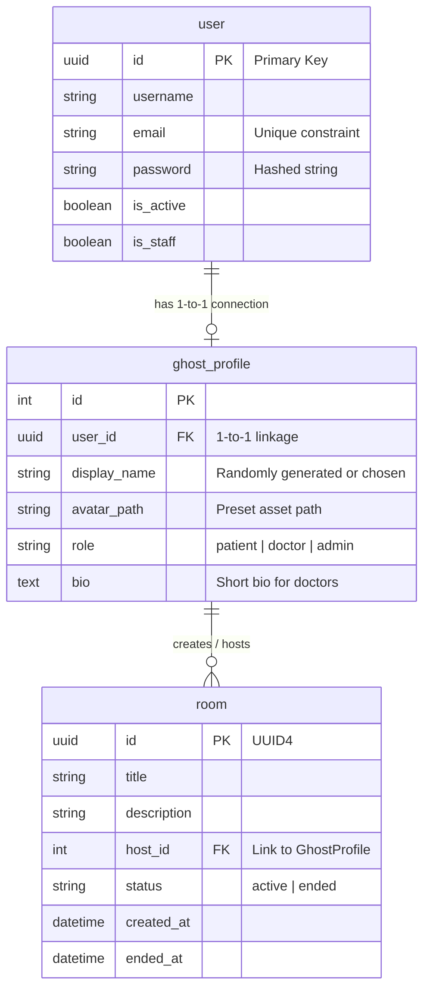
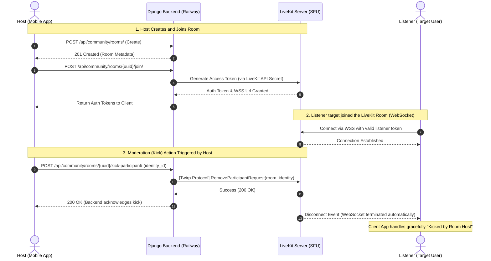

# รายงานความคืบหน้าโครงงาน (Midterm Progress Detailed Technical Report)
**ชื่อโครงงาน:** VivaClub (แพลตฟอร์มโซเชียลเสียงเรียลไทม์ และ ระบบปรึกษาแพทย์ออนไลน์)

**รายชื่อสมาชิก:**
1. Arefandy waeouseng 6610625037
2. Phuritat Lertkitpaisarn 6610685049

## 1. Tech Stack (สถาปัตยกรรมเทคโนโลยีที่ใช้)
ระบบถูกประดิษฐ์ขึ้นในรูปแบบ **Decoupled Architecture** (แยกกันระหว่างบ้านกับหน้าบ้านอย่างชัดเจน) โดยประกอบไปด้วย:

### 1.1 Frontend Architecture (สถาปัตยกรรมแอปพลิเคชันมือถือ)
- **Framework:** Flutter (Dart) ใช้พัฒนาเป็นแอปพลิเคชันที่สามารถทำงานได้ทั้ง iOS และ Android จาก Codebase เดียวกัน
- **State Management:** `flutter_bloc` (BLoC Pattern) ช่วยคุมลอจิกของการไหลเวียนข้อมูล (Data flow) ไม่ให้ปนกับ UI
- **Network / API Client:** `Dio` สำหรับใช้เป็น HTTP Client หลักในการพูดคุยกับ Backend (รองรับ Interceptors เพื่อขอ Refresh Token อัตโนมัติ)
- **Real-time Engine Client:** `livekit_client` สำหรับทำ WebRTC connections ในการสตรีมเสียงความหน่วงต่ำ
- **Secure Storage:** `flutter_secure_storage` สำหรับเก็บความลับ (Tokens) ในเครื่องโทรศัพท์

**หลักการทำงานของ BLoC Pattern ในแอปพลิเคชัน (Business Logic Component):**
เพื่อแก้ปัญหา Code ยุ่งเหยิง (Spaghetti Code) และทำให้แอปพลิเคชันตอบสนองได้อย่างเสถียร (Zero Crash) ทีมได้นำ BLoC Pattern มาเป็นสถาปัตยกรรมหลักในการแบ่งแยกหน้าที่ (Separation of Concerns) อย่างเคร่งครัด:
1. **UI Layer (ด่านนำเสนอ):** หน้าที่วาดหน้าจอ สร้างปุ่มกด คุมเฉพาะแอนิเมชัน ไม่มีการคำนวณใดๆ ปนอยู่เลย เมื่อผู้ใช้กดปุ่ม (เช่น กด Join Room) UI จะแค่ "พ่น Event" โยนทิ้งไว้ให้ BLoC นำไปจัดการ
2. **BLoC Layer (สมองกล):** เฝ้ารอรับ Event จาก UI แล้วนำไปคำนวณ หรือสั่งให้ Repository ไปทำงานต่อ เมื่อทำงานเสร็จหรือพัง BLoC จะทำการเปลี่ยนสถานะ (State) แล้วสะท้อนกลับไปบอก UI (เช่น ส่ง `LoadingState` -> `SuccessState` -> ทริกเกอร์เปลี่ยนหน้าจอ) 
3. **Repository/Service Layer (ท่อลำเลียงข้อมูล):** เป็นกรรมกรของ BLoC ทำหน้าที่ติดต่อสื่อสารกับโลกภายนอกเพียงอย่างเดียว เช่น วิ่งผ่าน Dio ไปคุยกับ Django API, โอนถ่าย Token ไปหา LiveKit Server แล้วมัดรวมข้อมูลส่งคืนเป็น Object (Dart Model) แจกให้ BLoC

*(ข้อดีของโครงสร้าง 3 ชั้นแบบนี้ คือแม้ในอนาคตทีมจะอยากเปลี่ยนดีไซน์ปุ่มกดใหม่ทั้งแอป หรือรื้อหน้าจอใหม่ ก็สามารถทำได้โดยที่โค้ดคำนวณหลังบ้านไม่พังเลย เพราะมันถูกตัดขาดจากกัน 100%)*

**แผนภาพ UML สถาปัตยกรรม Frontend (Frontend Architecture Diagram):**


### 1.2 Backend (เซิร์ฟเวอร์ และ API)
- **Framework:** Django และ Django REST Framework (DRF) พัฒนาด้วยอักษร Python
- **Authentication:** `Djoser` ร่วมกับ `djangorestframework-simplejwt` ทำระบบ Login แบบ Stateless-token
- **Database ORM:** กรองข้อมูลผ่าน Django ORM
- **WebRTC Controller:** เชื่อมต่อ LiveKit Server API สำหรับจัดการห้องประชุมเสียงและมอบ Access Token (Twirp protocol)

### 1.3 Infrastructure, Cloud และ Deployment
- **Cloud Provider (Main Backend):** ปัจจุบันใช้บริกการ **Railway.app** (PaaS) ในการ Host ตัวโค้ด Backend ทำงานร่วมกับ Docker อย่างอัตโนมัติ
- **Database Server:** **PostgreSQL** บน Railway
- **Audio/Media Server:** ใช้ **LiveKit Cloud** (หรือ Self-hosted LiveKit) ทำหน้าที่เป็น WebRTC Signaling Server และ SFU (Selective Forwarding Unit)
- **Mobile Deployment Environment:** รันจริงผ่านแอปเปิลออปชั่น (Apple Developer Provisioning Profile) บน iPhones เพื่อการทดสอบสิทธิ์ ฮาร์ดแวร์ ไมโครโฟน

## 2. ฐานข้อมูล (Database ER-Diagram & Schema)
ตอนนี้ Backend มีการเก็บข้อมูลลง Database (PostgreSQL) โดยมีการออกแบบและผูกความสัมพันธ์ดังรูปแบบ ER Diagram ด้านล่างนี้:



### ตาราง `User` (Custom User Model ของ Django)
- **หน้าที่:** ระบบจัดการบัญชีแม่ข่ายที่เน้นการรักษาความปลอดภัย (Data Minimization) ไม่เก็บข้อมูลส่วนตัวอื่นเจือปน
- **ฟิลด์ข้อมูล:**
  - `id`: (UUID หรือ AutoField) Primary Key ของยูเซอร์
  - `username`: ชื่ออ้างอิงของแต่ละระบบ
  - `email`: อีเมลสำหรับ Login และแจ้งข่าว (Unique Field)
  - `password`: รหัสผ่าน (เก็บเป็น Hash **PBKDF2** ไม่สามารถอ่านได้)
  - `is_active`, `is_staff`: ตัวระบุว่าบัญชียังใช้งานได้ หรือเป็นแอดมินไหม
- **ตัวอย่างโครงสร้างข้อมูล (Data Pattern):**
  ```json
  {
    "id": "123e4567-e89b-12d3-a456-426614174000",
    "email": "doctor.a@hospital.com",
    "password": "pbkdf2_sha256$600000$Salt$HashedStrig==...",
    "is_active": true
  }
  ```

### ตาราง `GhostProfile` (ข้อมูลผู้ใช้ที่เชื่อมกับ User เป็น 1-to-1)
- **หน้าที่:** หน้ากาก (Avatar) ที่ใช้แสดงต่อสาธารณะเพื่อรักษา Privacy ของผู้ใช้ 
- **ฟิลด์ข้อมูล:**
  - `user`: Foreign Key ไปยังตาราง User
  - `display_name`: ชื่อโปรไฟล์ที่จะโชว์ให้คนอื่นเห็น (ระบบสุ่มให้ หรือตั้งเองได้)
  - `avatar_path`: เส้นทางการเก็บรูปโปรไฟล์
  - `role`: ขอบเขตอำนาจบัญชี `patient` (คนไข้ทั่วไป/ผู้ฟัง), `doctor` (หมอ/ผู้เชี่ยวชาญ), `admin`
  - `bio`: ข้อความแนะนำตัวย่อๆ ของหมอ
  - `trust_score`: คะแนนความน่าเชื่อถือทางสังคม (เริ่มต้นที่ 100)
- **ตัวอย่างโครงสร้างข้อมูล (Data Pattern):**
  ```json
  {
    "user_id": "123e4567-e89b-12d3-a456-426614174000",
    "display_name": "Dr. Sam (Verified)",
    "role": "doctor",
    "trust_score": 150
  }
  ```

  **กลไกความปลอดภัยในการสร้างโปรไฟล์ (Preset-Only Policy):**
  เพื่อแก้ปัญหาการคุกคามและการใช้รูปโป๊เปลือย (Sexual/Harassment Content) ระบบจึงออกแบบให้โปรไฟล์ทำงานภายใต้ข้อบังคับ 2 อย่างนี้:
  1. **อัลกอริทึมสุ่มชื่อ (Random Name Generator):** ประยุกต์ใช้คลังคำศัพท์ปลอดภัย (Safe Word Bank) โดยดึง Category A (คำคุณศัพท์ เช่น Happy, Cosmic) มาต่อกับ Category B (คำนาม เช่น Panda, Ninja) และเติมตัวเลขต่อท้ายเพื่อป้องกันการซ้ำ เช่น `Happy_Panda_99` 
  2. **ระบบบังคับเลือกไอคอน (Preset Avatar Selection):** ปิดฟังก์ชันการ Upload รูปภาพจากอัลบั้มมือถือเด็ดขาดสำหรับผู้ใช้ทั่วไป (Patient/Listener) โดยบังคับให้ระบบสุ่มรูปจากคลังแอป (Asset Presets) ตอนสมัคร เช่น รูปแมว รูปหมามินิมอล และเปลี่ยนได้เฉพาะในตัวเลือกที่กำหนดเท่านั้น
  *(ข้อยกเว้น: เฉพาะบัญชีที่ยืนยันเป็นแพทย์ `role=doctor` เท่านั้นที่จะปลดล็อกให้ตั้งชื่อจริงและอัปโหลดรูปใบหน้าจริงได้เพื่อความน่าเชื่อถือ)*

### ตาราง `Room` (ห้องข้อความเสียง/ระบบคลับเฮาส์)
- **หน้าที่:** ตารางชั่วคราว (Lifecycle record) เกิดขึ้นเมื่อมีการกดสร้างห้องสนทนา
- **ฟิลด์ข้อมูล:**
  - `id`: Primary Key (UUID) เพื่อใช้อ้างอิงเป็น `Room Name` ในห้อง LiveKit
  - `title`: หัวข้อ/ชื่อห้องสนทนา
  - `description`: คำอธิบายห้อง
  - `host`: Foreign Key กลับไปหา `GhostProfile` ของคนที่สร้างห้อง (1-to-Many)
  - `status`: สถานะของห้อง (`active` หรือ `ended`)
  - `created_at` / `ended_at`: Timestamp วัน-เวลา ระบบจดบันทึกไว้สำหรับคำนวณเงินในอนาคต
- **ตัวอย่างโครงสร้างข้อมูล (Data Pattern):**
  ```json
  {
    "id": "room-8f14-41d3-b1d5-9856",
    "title": "ห้องด่วน: อกหักรับวาเลนไทน์ คุยกันได้นะ",
    "host_id": "Dr. Sam (Verified)",
    "status": "active",
    "created_at": "2026-02-14T10:00:00Z"
  }
  ```

## 3. ระบบความปลอดภัยและการเข้ารหัสลับ (Encryption & Security Methods)

เพื่อให้สอดคล้องกับมาตรฐานอุตสาหกรรม (Industry standards) ซอร์สโค้ดของ VivaClub ได้วางมาตรการด้าน Security ไว้ 4 ระดับ:

1. **Password Encryption (At Rest):** 
   - รหัสผ่านทุกชนิดจะถูกประทับตรารหัส (Hashes) ก่อนเซฟลง PostgreSQL เสมอด้วยแกนหลัก **PBKDF2 (Password-Based Key Derivation Function 2)** พร้อมกลไกผสมเกลือ (HMAC-SHA256) 
   - **หลักการทำงานเชิงลึก:** เมื่อผู้ใช้กรอกรหัสผ่าน `123456` ระบบ (Django Auth) ไม่ได้เซฟเลข 123456 ลงฐานข้อมูล แต่มันจะนำไปบวกค่าเกลือ (Random Salt) และทำซ้ำ (Iterations) กว่า 700,000 รอบ จนได้ลายนิ้วมือดิจิทัลที่ถอดความหมายกลับไม่ได้ ป้องกันการโจมตีแบบ Rainbow Table Attack
   - **ตัวอย่างข้อมูลที่เซฟจริงในฐานข้อมูล:** `pbkdf2_sha256$720000$RandomSaltData$HASHED_PASSWORD_DATA=`

2. **Access Token (In Memory - Stateless Authentication):** 
   - ระบบ Login ของแอปเราทำงานแบบแจกจ่าย **Stateless JSON Web Token (JWT)** โดยที่ไม่ต้องจดจำ Session ไว้ในฐานข้อมูลให้เปลืองหน่วยความจำเซิร์ฟเวอร์ 
   - **กลไกความปลอดภัย (Self-Destructing & Rotation):**
     - ฝั่ง Backend (Django REST Framework) ถูกตั้งค่าให้ Access Token มีอายุใช้งานสั้นเพียง **60 นาที** หากแฮกเกอร์ขโมย Token ระหว่างทาง (In-transit) ก็จะหมดอายุอย่างรวดเร็ว
     - ในขณะที่ผู้ใช้ใช้งานแอป ตัวแอปจะนำ `Refresh Token` แอบวิ่งไปสลับเอา Access Token ใบใหม่ให้เนียนๆ ทำให้ Login ไม่หลุด (Token Rotation) และลดความเสี่ยง
     - เมื่อ Token ครบอายุขัย ระบบ Blacklist ของเซิร์ฟเวอร์จะกำจัดทิ้งทันทีไม่ต้องเรียก Database Query ประหยัดทรัพยากรตอนเคลียร์คนออก

3. **Data Transport Encryption (In Transit):** 
   - ทุกๆ Request สู่ REST API จะวิ่งผ่านโปรโตคอล **HTTPS (TLS 1.2/1.3)** เพื่อซ่อนข้อมูล (Payload data)
   - **การเข้ารหัสเสียงสนทนาด้วย SRTP (Secure Real-time Transport Protocol):** 
     - เนื่องจากแอปเราทำงานบนมาตฐานของ WebRTC ดังนั้นข้อมูลภาพและเสียง **จะเป็นไปไม่ได้เลยที่จะส่งแบบตัวเปล่า (Unencrypted) ลงสู่อินเทอร์เน็ต**
     - ก่อนที่แพทย์และคนไข้จะเริ่มสนทนากันในห้อง Telemedicine ตัวแอป (Client) จะทำการจับมือแลกเปลี่ยนแม่กุญแจถอดรหัสผ่านกระบวนการ **DTLS-SRTP Handshake** 
     - เมื่อคุยกัน ไฟล์เสียง (Audio Packets) ทั้งหมดจะถูกจับยัดกล่องล็อกกุญแจ ส่งผลให้หากมีใครหรือผู้ให้บริการเครือข่ายดักจับแพคเก็ต (Packet Sniffing) กลางทาง ก็จะได้เพียง "ขยะดิจิทัล (Gibberish)" ที่ฟังไม่รู้เรื่อง รักษาความลับทางการแพทย์ได้อย่างสมบูรณ์แบบ
4. **Client Secret Storage (Mobile):** 
   - ใช้หลักการจัดเก็บ Token ในบริเวณที่ลึกที่สุดของ OS โดยการใช้ไลบรารี `flutter_secure_storage` 
   - iOS: บันทึกเข้าฐานระบบรักษาความปลอดภัย **Apple Keychain**
   - Android: บันทึกเข้า **Android Keystore (Encrypted Shared Preferences)**

## 4. รายชื่อเส้นทาง API ทั้งหมดที่มีการใช้งาน (Backend API Routes Listing)

ได้ดำเนินการพัฒนาและผูกเชื่อมการทำงานกับ Mobile App เรียบร้อยในหัวข้อเกี่ยวกับ Authen และ ห้องสด (Live Audio Rooms) ดังนี้:

### กลุ่ม Authentication APIs (จัดการบัญชีผู้ใช้งาน)
1. **`POST /api/auth/register/`**
   - **หน้าที่:** รับ Email, Username, Password เข้ามา สร้างบัญชีและแฮชรหัสผ่านลง DB
2. **`POST /api/auth/login/`**
   - **หน้าที่:** รับ Email/Password ส่งกุญแจ Access Token สิทธิ์เบื้องหลังสำหรับใช้กับ API อื่น
3. **`GET /api/auth/profile/`**
   - **หน้าที่:** สำหรับเข้าเช็กโปรไฟล์ และคืนค่า Username, Role (เช่น สิทธิความเป็นหมอ) ให้หน้าจอมือถือโชว์ได้ถูกหน้า

### กลุ่ม Community Rooms APIs (จัดการระบบพูดคุยเสียง)
4. **`GET /api/community/rooms/`**
   - **หน้าที่:** ดึงรายการห้องเสียง (List) ที่มีสถานะว่า `active` ทั้งหมดให้ผู้ใช้เลือกเข้าฟัง
5. **`POST /api/community/rooms/`**
   - **หน้าที่:** เอา Payload (Title) เข้ามา สร้างห้องบน DB อัตโนมัติและมอบสถานะว่าตนเป็นโฮสต์ (Host)
6. **`POST /api/community/rooms/<room_id>/join/`**
   - **หน้าที่หลักมาก (Core Architecture):** เมื่อแอปขอ join จะทำการให้ Django วิ่งไปเรียกเซอร์วิส **LiveKit Server Cloud** เพื่อขอรับ **Access Token (WebRTC Signal)** แล้วโยนให้มือถือ เครื่องลูกก็จะใช้รับสัญญาณเสียงได้เลย โดยแยกประเภท (Speaker/Listener)
7. **`POST /api/community/rooms/<room_id>/leave/`**
   - **หน้าที่:** ระบุการออกจากห้องผ่าน Database (แอปต้องส่งออก WebRTC เองที่เครื่องด้วย)
8. **`POST /api/community/rooms/<room_id>/invite/`**
   - **หน้าที่:** ผู้ที่เป็นโฮสต์ขอส่งออปชั่นดึง Listener (ผู้ฟังธรรมดา) กลับมารับสิทธิ์เป็น Speaker เปลี่ยนโหมด Permission บน LiveKit อย่างเรียลไทม์

### กลุ่ม Moderation API (ระบบจัดการผู้พูด และเตะผู้เล่น - เพิ่งพัฒนาติดตั้งเสร็จ)
9. **`POST /api/community/rooms/<room_id>/mute-participant/`**
   - **หน้าที่:** โฮสต์ใช้ API ตัวนี้โยนคำสั่งระงับไมค์ (Mute) บังคับปิดสัญญาณเสียงโดยอ้างถึง `track_sid` และ `identity` ของคนในห้อง Backend จะส่งสัญญาณ API สั่งไปที่โปรโตคอลของ LiveKit ปิดซอร์สเสียงแบบทันที (Force Disable Audio)
10. **`POST /api/community/rooms/<room_id>/kick-participant/`**
    - **หน้าที่:** โฮสต์สั่งเตะ (Kick/Disconnect) อาชญากรป่วนห้อง Backend จะรีเควสต์ไปยัง LiveKit ให้ตัดการเชื่อมต่อ WebSocket และปิด Connection อัตโนมัติ

## 5. อัลกอริทึมคะแนนความน่าเชื่อถือ (Trust Score Algorithm)
เพื่อป้องกันปัญหา **การกลั่นแกล้งกันด้วยการรุมรีพอร์ต (False Reporting)** ที่พบได้บ่อยในแอปโซเชียลทั่วไป ระบบจึงถูกออกแบบให้มีกลไกคัดกรองพฤติกรรมผู้ใช้ด้วยมาตรฐาน **Weighted Voting (การโหวตแบบให้น้ำหนัก)** โดยมีลำดับตรรกะดังต้อไปนี้:

1. **Base Score (คะแนนตั้งต้น):** 
   - ผู้ใช้ทุกคนเริ่มที่คะแนน 100 แต้ม การกระทำหลังจากนี้จะกำหนดน้ำหนักของคำพูด (Report Power) ของตนเอง
2. **Positive Weight (การได้คะแนนเพิ่ม):**
   - ถ้านาย A กด Report คุกคาม แล้วแอดมินตรวจสอบว่า "ผิดจริง" นาย A จะได้ Trust Score เพิ่ม (เช่น +10) 
   - **ผลลัพธ์:** เสียงและคำรีพอร์ตของนาย A ในครั้งถัดๆ ไปจะมีน้ำหนักมากกว่าคนปกติ
3. **Negative Weight (บทลงโทษจากการกลั่นแกล้ง):**
   - ถ้านาย B เกณฑ์เพื่อนมารุม Report คนอื่นมั่วๆ แล้วแอดมินตรวจสอบแล้วพบว่า "ไม่ผิด (False Report)"
   - นาย B และแก๊งค์เพื่อน จะโดนหัก Trust Score ทิ้งทันที (เช่น -20 ถึง -50)
   - **ผลลัพธ์:** เมื่อ Trust Score ต่ำมาก คำขอ Report ครั้งถัดไปของนาย B จะถูกระบบจับโยนลงถังขยะอัตโนมัติ (ขุยขยะ/Spam Filter) แม้จะกดมาพันครั้งก็ไม่มีผล
4. **Auto-Ban Threshold (ศาลเตี้ยอัตโนมัติ):**
   - ระบบจะรวม (Sum) คะแนน Trust Score ของทุกคนที่กด Report บุคคลเป้าหมาย 
   - หากผลรวมทะลุ Threshold (เช่น > 500 แต้ม) ระบบจะทำการ **Auto-Kick ทันทีข้ามหน้าแอดมินมนุษย์** เพื่อยุติความวุ่นวายในห้องแบบ Real-time
5. **Promotion & Privileges (สิทธิประโยชน์คนดีแบบออโต้):**
   - หากผู้ใช้มีระดับคะแนน Trust Score สะสมเกิน **180 แต้ม** ประวัติขาวสะอาด ระบบจะรัน Script เลื่อนขั้นให้เป็น **Community Moderator (ผู้คุมกฎอาสาสมัคร)** 
   - ผู้คุมกฎจะมีอาวุธติดตัวคือปุ่ม **"Mute/Kick อัตโนมัติในห้องคนอื่น"** โดยไม่ต้องรอโหวตให้เสียเวลา เพื่อตอบแทนบุคลากรคุณภาพของเครือข่าย

*(อัปเดตงาน Frontend เชิงกลไก: ปุ่มหน้า Home Dashboard และ LiveRoom มีการเพิ่มปุ่ม Tap-and-hold เรียก Moderation Dialogue ไว้แล้ว พร้อมใช้กลไก LiveKit Metadata ซิงโครไนซ์สถานะ "การยกมือ - Hand Raise" ระหว่างสมาร์ทโฟนฝั่งผู้ฟังและโฮสต์)*

**แผนภาพ Sequence Diagram: ลำดับการตั้งห้องละการเตะคนป่วน (Room Call & Moderation Flow):**


## 5. การทดสอบและการครอบคลุมของโค้ด (Testing & Test Coverage)

เพื่อให้สถาปัตยกรรมทำงานได้อย่างมีเสถียรภาพที่สุด ทีมได้ดำเนินการเขียน **Automated Test Scripts** เพื่อจำลองพฤติกรรมผู้ใช้งานจำนวนมาก และลดข้อผิดพลาดก่อนนำขึ้นโปรดักชัน (Production Deployment):

### 5.1 Backend API Unit & Integration Tests (Django)
มีการจำลองส่งคำขอ (Mock Requests) และยิงทดสอบ API ผ่าน Script อย่างต่อเนื่อง (เช่น `test_api.sh`, `test_clubhouse.py`)
- **Authentication Flow:** รันสคริปต์สุ่มสร้าง User ใหม่หลายรูปแบบเพื่อทดสอบการ Hash Password และการป้องกัน User ขยะ
- **Room Management Load Test:** ทดสอบสร้างห้องทีละหลายสิบห้องพร้อมกัน เพื่อเช็กว่า Database Transaction ไม่เกิด Deadlock และเซิร์ฟเวอร์ตอบกลับรหัส `200 OK`

### 5.2 Real-time Engine Testing (WebSocket & LiveKit Integration)
นี่คือส่วนที่ทำ Test Coverage ลึกที่สุดเนื่องจากเป็น Core Feature:
- **WebRTC Handshake Validation:** เขียนโค้ด (Python/LiveKit Client ในสคริปต์ `test_invite_isolated.py` และ `test_interactions_connected.py`) จำลองสร้างบอท 1 ตัวเป็นโฮสต์ และบอทอีก 1 ตัวเป็นผู้ฟัง (Listener) เข้ามาต่อ WebSocket ชนกันในห้องเดียวกัน
- **State Consistency Coverage:** ตรวจสอบความถูกต้องของการกระจายข่าว (Event Broadcasting)
  - ทดสอบระบบ Hand Raise (ยกมือ) ว่าเมื่อ Listener ขอยกมือ Metadata ของห้องจะต้องอัปเดตไปถึงโฮสต์ **100% (Pass)**
  - เมื่อโฮสต์เตะ (Kick) หรือ ปิดไมค์ (Mute) บอทที่เป็น Listener จะต้องถูกบล็อกจาก Audio Track และถูกตัดออกจาก LiveKit ทันที (Test Passed and Confirmed via API code 200)

### 5.3 Frontend QA & Device Compatibility Tests
- ทดสอบการรันผ่าน Flutter UI จริง บน iOS Simulator และ **อุปกรณ์จริง (iPhone)** เพื่อตรวจสอบ Native Permissions (ไมโครโฟน) สิทธิ์ในการส่องทิศทางเสียง รวมถึงตรวจสอบ Memory Leaks ในกรณีถอดสายและใช้โหมด Release (`flutter run --release`) ซึ่งแอปปัจจุบันเสถียรและสามารถใช้งานต่อเนื่องได้โดยไม่มี Crash Log

## 6. แผนพัฒนาในโค้งสุดท้าย (Remaining Final Phase)

การทำงานในฝั่ง Backend, WebRTC Engine และ Flutter UI ลุล่วงเปรียบเทียบในหมวด "Audio Club Feature" แบบสมบูรณ์แล้ว งานถัดไปของทีม (Remaining Task) คือฝั่ง "Telemedicine/Monetization" เพื่อตอบโจทย์ธุรกิจแอปรวม (Business Logic Requirement):

1. **ระบบจองเวลาแพทย์ (Scheduled Consultations)**
   - API กลุ่ม `/api/bookings/slots/` (เพิ่มตาราง DB เพื่อเซฟกรอบเวลาคิวของหมอแต่ละท่าน)
   - หน้าจอ (Flutter) รูปแบบปฏิทิน และการล็อกห้อง Private คุยสองคนแบบจับเวลาถอยหลัง (Expired token handling ด้วย LiveKit)
2. **กระเป๋าเงิน และ การเปย์เหรียญสด (In-App Wallet & Subscriptions)**
   - สคีมา (Schema): `Wallet` (ยอดเงินปัจจุบัน) และ `Transaction` (ประวัติการเปย์ / เหรียญโอนให้โฮสต์)
   - Mocking Payment และเหรียญเปย์ขวัญกำลังใจเป็นแอนิเมชันขึ้นจอบน Flutter ที่ลดบารอมิเตอร์ (token deducing) หลังบ้านอย่างปลอดภัย
3. **ระบบแจ้งเตือนฉับไว (Push Notifications Backend)**
   - เชื่อมต่อโปรเจกต์กับ **Firebase Cloud Messaging (FCM)** ให้โทรศัพท์ดังเตือนแม้ปิดจอ กรณีหมอที่คุณตามกดเปิดห้องแล้ว ("Doctor [...] has started a room!") หรือเมื่อใกล้ถึงคิวปรึกษา
