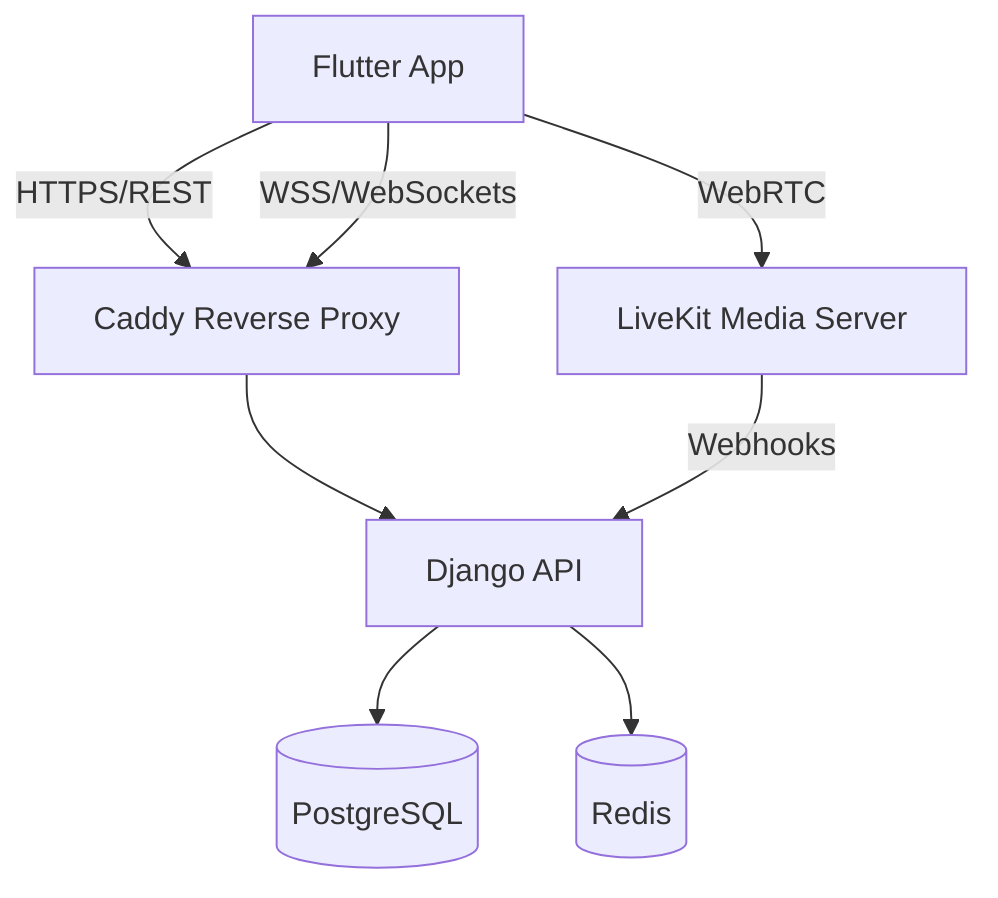

# VivaClub 🌿
**A Real-Time Mental Health Platform Combining Anonymous Community Support and Clinical Telemedicine**

[](https://flutter.dev)
[](https://www.djangoproject.com/)
[](https://livekit.io/)
[](https://www.docker.com/)

VivaClub is a comprehensive mental health solution designed to bridge the gap between community peer support and professional clinical care. It features an anonymous audio-room community (inspired by Clubhouse) and a robust telemedicine system for private consultations and emergency SOS interventions.

---

## ✨ Key Features

### 👻 Anonymous Community (Ghost Profiles)
- **Privacy First:** Users interact using "Ghost Profiles" (e.g., *Happy Panda #42*) with random names and avatars to eliminate social stigma.
- **Audio Rooms:** Real-time audio discussions with host moderation (Invite, Mute, Kick) powered by WebRTC.
- **Trust System:** A custom algorithm that calculates user credibility to prevent abuse and false reporting.

### 🏥 Clinical Telemedicine
- **PHQ-9 Assessment:** Built-in clinical screening tool to monitor depression levels and triage risk.
- **SOS Emergency:** One-tap emergency connection to standby doctors for users at severe risk levels.
- **Private Consultations:** Secure 1-on-1 video calls with E2EE (End-to-End Encrypted) clinical notes.
- **Booking System:** Integrated calendar for scheduling appointments with verified psychiatrists.

### 🔒 Security & Privacy
- **E2EE Notes:** Medical notes are encrypted on the client-side; the server never sees the raw content.
- **Thai Carrier Optimization:** Custom TURN server configuration over TCP 443 to bypass MTU blackholes on AIS/True/DTAC networks.
- **PDPA Compliant:** Designed with data minimization and explicit consent at the core.

---

## 🛠️ Tech Stack

- **Mobile:** [Flutter](https://flutter.dev) (BLoC Pattern, Clean Architecture)
- **Backend:** [Django REST Framework](https://www.django-rest-framework.org/)
- **Real-Time Media:** [LiveKit](https://livekit.io/) (WebRTC SFU)
- **Database:** [PostgreSQL](https://www.postgresql.org/) (Main), [Redis](https://redis.io/) (Cache & WebSockets)
- **Infrastructure:** Docker Compose, Caddy (Reverse Proxy), Contabo VPS (Singapore)

---

## 🚀 Getting Started

### Backend Setup (Docker)
1. Clone the repository:
   ```bash
   git clone https://github.com/arefandywae-lab/VivaClub.git
   cd VivaClub/Server
   ```
2. Create your `.env` file from the template.
3. Run with Docker Compose:
   ```bash
   docker-compose up --build
   ```

### Mobile Setup (Flutter)
1. Navigate to the Flutter directory:
   ```bash
   cd ../Flutter/viva_club
   ```
2. Install dependencies:
   ```bash
   flutter pub get
   ```
3. Run the app:
   ```bash
   flutter run
   ```

---

## 📊 System Architecture


---

## 👥 Team
- **Arefandy Waeouseng** - Backend, Infrastructure & Integration
- **Phuritat Lertkitpaisarn** - Mobile UI/UX & Frontend Logic

---

## 📝 License
This project is part of a Senior Project at King Mongkut's Institute of Technology Ladkrabang (KMITL).
